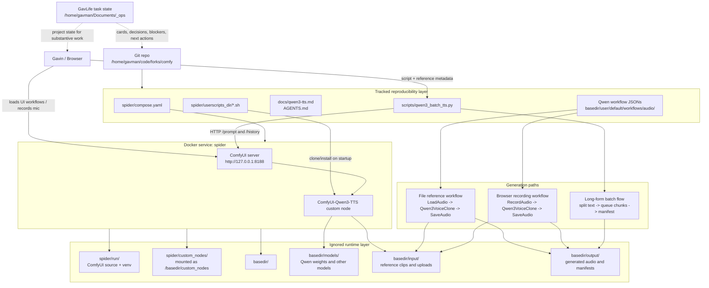

# Qwen3-TTS ComfyUI Setup

This repo tracks the Docker configuration, startup scripts, reusable workflows,
and API driver needed to recreate the Qwen3-TTS work.

It intentionally does not track large runtime data:

- `basedir/models/`
- `basedir/input/`
- `basedir/output/`
- `spider/run/`
- `spider/custom_nodes/`

Those folders contain downloaded models, generated media, local ComfyUI runtime
state, venvs, and cloned custom nodes. They can be recreated or redownloaded.

## Architecture



The main seam is the Comfy HTTP API. Interactive work can happen in the
browser with tracked workflow JSONs, while long-form generation is driven by
`scripts/qwen3_batch_tts.py` without embedding looping logic into a visual
workflow. The repo tracks only the reproducibility layer; model weights,
reference media, generated outputs, cloned custom nodes, and venv/runtime state
remain local runtime data.

## Runtime

The active Docker service lives in `spider/`:

```bash
cd /home/gavman/code/forks/comfy/spider
docker compose up -d
```

ComfyUI serves:

```text
http://127.0.0.1:8188
```

The container mounts:

- `../basedir` at `/basedir`
- `./custom_nodes` at `/basedir/custom_nodes`
- `./userscripts_dir` at `/userscripts_dir`

## Qwen3-TTS

Startup script `spider/userscripts_dir/07-install-qwen3-tts.sh` ensures:

- `DarioFT/ComfyUI-Qwen3-TTS` is cloned into `/basedir/custom_nodes/ComfyUI-Qwen3-TTS`
- `sox` is installed
- Qwen3-TTS Python dependencies are installed in the active Comfy venv

The Qwen model weights are not tracked. They download into:

```text
basedir/models/Qwen3-TTS/
```

## Workflows

Tracked reusable workflows:

- `basedir/user/default/workflows/audio/qwen3_tts_voice_clone.json`
- `basedir/user/default/workflows/audio/qwen3_tts_record_voice_clone.json`

The file-based workflow uses `LoadAudio`. The recording workflow uses
`RecordAudio` for browser microphone input.

For voice clone, `Qwen3VoiceClone.ref_text` must match the reference audio
exactly.

## Batch Driver

Long text should be generated with the external API driver:

```bash
python3 scripts/qwen3_batch_tts.py \
  --reference-audio my_voice_ref.wav \
  --reference-text "exact words read in the reference recording" \
  --script-file /path/to/long_script.txt \
  --project-name my-reading
```

Outputs are saved under:

```text
basedir/output/audio/qwen3_projects/<project-name>/
```

Each project folder includes `manifest.json` for restartability.
